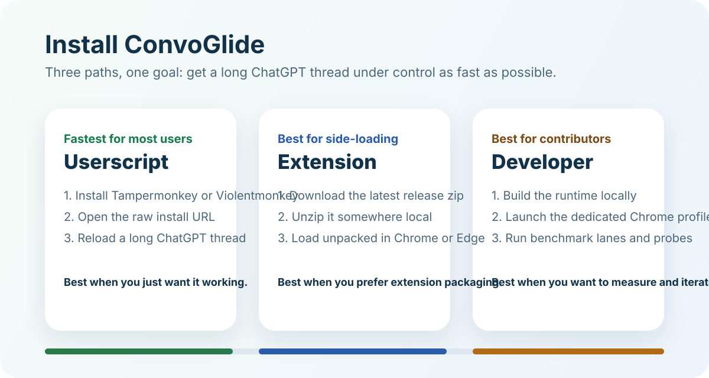
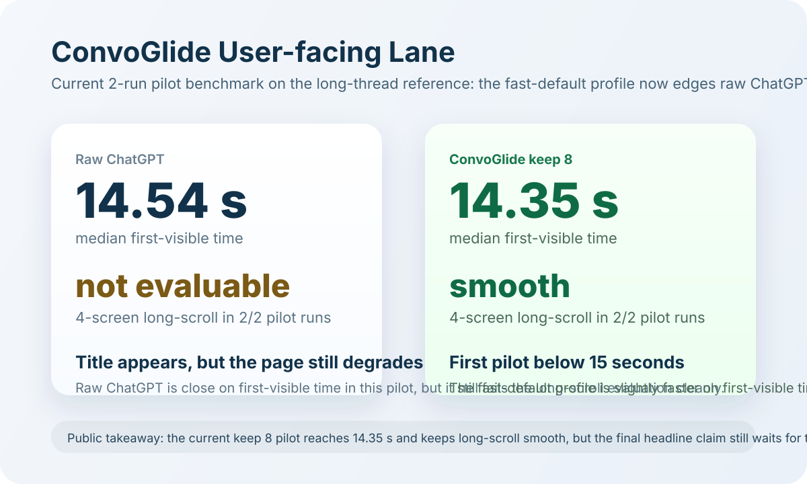

[English](README.md) | [简体中文](README.zh-CN.md)

# ConvoGlide

**让超长 AI 对话重新变顺。**

ConvoGlide 是一个实验性开源项目，目标是减少 AI 网页长对话的卡顿。当前公开 alpha 版本刻意只先支持 **ChatGPT Web**，先把运行时、benchmark、安装路径和发布流程一起做稳。

`Experimental` `ChatGPT-first` `Local-only` `MIT`

## 快速开始

- Userscript 一键安装： [raw 安装链接](https://raw.githubusercontent.com/qimw/convoglide/main/userscript/convoglide.user.js) 或见 [docs/install.md#userscript](docs/install.md#userscript)
- 浏览器扩展安装：下载最新 [GitHub release assets](https://github.com/qimw/convoglide/releases) 或直接加载 [`extension/`](extension)；细节见 [docs/install.md#browser-extension](docs/install.md#browser-extension)
- 开发者本地调试：见 [docs/install.md#developer-setup](docs/install.md#developer-setup)

## 它解决什么问题

ConvoGlide 主要针对两类性能问题：

- **打开就慢**
  - 超长会话在页面真正可用前，就已经让浏览器先吞下一份很大的 conversation payload
  - 当前 alpha 已经在裁这份 payload，而且在这条 benchmark 对话上已经跑出了一个小幅领先的首次可见时间预实验结果
- **打开后越来越卡**
  - 会话打开后，滚动、输入、交互会随着历史内容过多而变卡

## 效果摘要

以下结果来自一条真实的超长 ChatGPT 对话：

当前公开 headline 结果仍然只是 **`n=2` 的预实验 benchmark**。等这一轮优化做完后，公开主结论会统一刷新成 `n=5`。

当前这轮面向用户的预实验，主要回答两个问题：

- 目标会话第一次真正显示出来要多久
- 页面打开后，**4 屏长滚动测试**是否顺畅

目前这条 benchmark 对话上的预实验结论：

- 原始 ChatGPT 的首次可见时间中位数：`14.54 s`
- ConvoGlide 默认 `keep 8` 的首次可见时间中位数：`14.35 s`
- 原始 ChatGPT 在 `2/2` 轮里都没能干净完成长滚动评估
- ConvoGlide 在 `2/2` 轮里都测出了 `smooth`
- 所以当前最可靠的公开结论是：**打开后更顺了**；同时，这一轮预实验里首次可见时间也已经略快于原始页面

| 版本 | 策略 | 首次可见时间中位数（`n=2`） | 标准化 4 屏长滚动测试 | 当前解读 |
| --- | --- | ---: | --- | --- |
| 原始 ChatGPT | 无优化 | `14.54 s` | `2/2` 轮都无法干净完成评估 | 标题能较快出现，但页面依然很难稳定完成长滚动评估 |
| ConvoGlide | 默认 `keep 8` | `14.35 s` | `2/2` 轮都是 `smooth` | 这一轮预实验里首次可见时间略快，而且页面打开后明显更顺 |

公开文档里的长滚动口径，统一按 **4 屏参考距离** 描述。这里的参考值是 `3928 px`，来源于 14 英寸 MacBook Pro 默认逻辑高度 `982 px × 4`。当前预实验自动化仍会被页面实际可滚动距离限制，因此实际滚动距离可能小于 `3928 px`。

### 工程迭代快照

| Iteration | 策略 | Payload | 稳态 DOM | Heap | 备注 |
| --- | --- | ---: | ---: | ---: | --- |
| 0 | 基线 | ~5.0 MB | 难以稳定探测 | n/a | 真实长线程在完全加载后会很重 |
| 1A | 保留最近 `120` 条消息 | ~0.38 MB | ~11.8k | ~112 MB | 只做首屏裁剪 |
| 1B | 保留最近 `80` 条消息 | ~0.30 MB | ~9.1k | ~99 MB | 适合作为加载后虚拟化压力测试档位 |
| 1C | 保留最近 `8` 条消息 | ~0.07 MB | n/a | n/a | 当前默认快开档位，payload 总量约下降 `98.6%` |
| 2 | `80` 档 + 加载后虚拟化 MVP | ~0.30 MB | ~3.8k | ~99 MB | 已虚拟化 `33/45` 个 turn，DOM 相比 1B 再降约 58% |
| 3 | Iteration 2 + heavy block lazy activation MVP | ~0.30 MB | ~3.5k | ~100 MB | 额外延迟了 `13` 个重块，DOM 相比 2 再降约 9% |

详细结果见 [docs/benchmarks.md](docs/benchmarks.md)

## 优化目标

下一轮公开 benchmark 刷新，我现在按下面这些目标推进：

- 公开主 benchmark 升级到 **5 次**
- 首次可见时间至少要继续保持 **不慢于原始页面的中位数**，并把当前 **`<= 15 s`** 的预实验结果延续到正式 `n=5`
- **4 屏长滚动测试** 要做到 **`5/5` 都是 `smooth`**
- 默认档位的稳态 DOM 继续压到 **`<= 3.0k`**
- 默认档位的稳态 heap 继续压到 **`<= 90 MB`**

## TODO / 路线图

- [x] ChatGPT 长对话 payload 预裁剪
- [x] 从原型命名硬切换到 ConvoGlide
- [x] 清理公开 API，只保留 `window.ConvoGlide`
- [x] Userscript alpha 安装路径
- [x] Userscript 一键安装链接
- [x] Chrome / Edge 侧载扩展路径
- [x] Iteration 0 和 Iteration 1 的公开 benchmark 摘要
- [x] 首版加载后虚拟化 benchmark 摘要
- [x] 本地自动化 benchmark lane
- [x] extension zip 打包脚本
- [x] 面向大代码块和表格的 heavy block lazy activation MVP
- [x] 支持点击和键盘恢复虚拟化 turn / heavy block
- [x] release checklist 文档
- [x] 浏览器商店准备度 checklist
- [x] 文档一致性校验
- [ ] 加载后虚拟化调优
- [ ] 图片、媒体和内存恢复路径的进一步调优
- [x] 首个真实 tagged alpha release 验证
- [x] 更多安装和 benchmark 视觉材料

展开版路线图见 [docs/roadmap.md](docs/roadmap.md)

## 原理

### Optimization 1：解决打开就慢

ConvoGlide 会在 ChatGPT 前端 hydration 之前，拦截超长 conversation payload，并只保留活跃分支最近的一部分消息节点，从而降低首屏载荷。

当前公开 alpha 默认保留最近 `8` 条消息，因为这是目前第一档把这条 benchmark 对话压进 `15 s` 以内、同时还保住顺滑长滚动结果的配置。如果你想保留更多近期历史，也可以手动切到 `80` 或 `120`。

### Optimization 2：解决打开后卡

ConvoGlide 还包含一个加载后虚拟化 MVP。它会尽量保持视口附近消息处于活跃渲染状态，把远离视口的内容替换成轻量占位，从而降低滚动和输入阶段的负担。

### Optimization 3：延迟激活重块

ConvoGlide 现在还会对仍处于活跃 turn 中、但离视口较远的大型 `pre` 和 `table` 做更细粒度的延迟激活，并给图片/视频等媒体补懒加载提示。

当前这版已经能明显降低离屏 DOM 成本，但堆内存改善还没有 DOM 那么漂亮，因为 alpha 方案会保留已脱离 DOM 的 turn 和 heavy block 快照用于快速恢复。后续会继续围绕这一点做调优。

架构说明见 [docs/architecture.md](docs/architecture.md)

## 项目结构

- `src/runtime/`
  - 共享的 ChatGPT 运行时核心源码
- `userscript/`
  - 用户脚本输出
- `extension/`
  - Chrome / Edge 侧载扩展文件
- `scripts/`
  - build、benchmark、probe 工具
- `docs/`
  - 安装、benchmark、架构、路线图、FAQ
- `docs/assets/`
  - README 和公开文档用的轻量示意图

## 文档

- 安装： [docs/install.md](docs/install.md)
- Benchmark： [docs/benchmarks.md](docs/benchmarks.md)
- Benchmark 工作流： [docs/benchmark-workflow.md](docs/benchmark-workflow.md)
- 架构： [docs/architecture.md](docs/architecture.md)
- 路线图： [docs/roadmap.md](docs/roadmap.md)
- FAQ： [docs/faq.md](docs/faq.md)
- 发布： [docs/releasing.md](docs/releasing.md)
- 商店准备度： [docs/store-readiness.md](docs/store-readiness.md)

## License

[MIT](LICENSE)

## 实验说明

ConvoGlide 是一个纯 **vibecoding** 的实验性项目，由 **ChatGPT Plus 计划中的 Codex** 协作构建。
