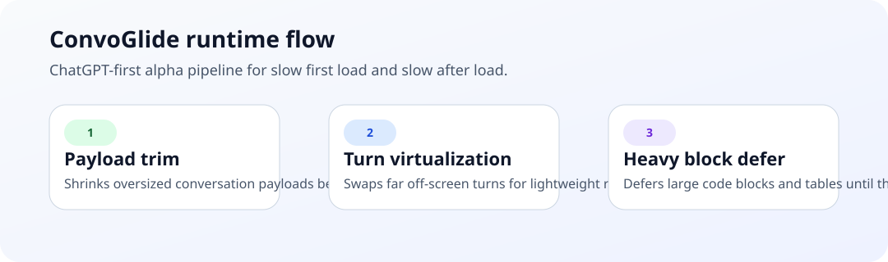

[English](README.md) | [简体中文](README.zh-CN.md)

# ConvoGlide

**让超长 AI 对话重新变顺。**

ConvoGlide 是一个实验性开源项目，目标是减少 AI 网页长对话的卡顿。当前公开 alpha 版本刻意只先支持 **ChatGPT Web**，先把运行时、benchmark、安装路径和发布流程一起做稳。

`Experimental` `ChatGPT-first` `Local-only` `MIT`

## 快速开始

- Userscript 一键安装： [raw 安装链接](https://raw.githubusercontent.com/qimw/convoglide/main/userscript/convoglide.user.js) 或见 [docs/install.md#userscript](docs/install.md#userscript)
- 浏览器扩展安装：下载最新 [GitHub release assets](https://github.com/qimw/convoglide/releases) 或直接加载 [`extension/`](extension)；细节见 [docs/install.md#browser-extension](docs/install.md#browser-extension)
- 开发者本地调试：见 [docs/install.md#developer-setup](docs/install.md#developer-setup)

## 它解决什么问题

ConvoGlide 主要针对两类性能问题：

- **打开就慢**
  - 超长会话在页面真正可用前，就已经让浏览器先吞下一份很大的 conversation payload
  - 当前 alpha 已经在裁这份 payload，但“总加载耗时稳定更短”还在继续调优
- **打开后越来越卡**
  - 会话打开后，滚动、输入、交互会随着历史内容过多而变卡

## 效果摘要

以下结果来自一条真实的超长 ChatGPT 对话：

同一条长对话的人话结论：

- 在最新一轮重复 user-facing lane 里，原始 ChatGPT 做了 `2` 轮，能稳定撑到 `50 秒` 的是 `0/2`
- 同一轮里，ConvoGlide 默认档位 `keep 20` 能稳定撑到 `50 秒` 的是 `2/2`
- 原始页面在 `2/2` 轮里都没能完成一次合成长滚动探测，而 ConvoGlide 在 `2/2` 轮里都测出了 `smooth`
- 目前“总加载毫秒数稳定变短”还不能下公开结论，所以这版 alpha 更准确的说法是：它先明显改善了稳定性和滚动顺滑度

| Iteration | 策略 | Payload | Mapping nodes | 稳态 DOM | Heap | 备注 |
| --- | --- | ---: | ---: | ---: | ---: | --- |
| 0 | 基线 | ~5.0 MB | ~1820 | 难以稳定探测 | n/a | 真实长线程在完全加载后会很重 |
| 1A | 保留最近 `120` 条消息 | ~0.38 MB | 121 | ~11.8k | ~112 MB | 50 秒内仍可稳定探测 |
| 1B | 保留最近 `80` 条消息 | ~0.30 MB | 81 | ~9.1k | ~99 MB | 更适合作为加载后虚拟化压力测试档位 |
| 2 | `80` 档 + 加载后虚拟化 MVP | ~0.30 MB | 81 | ~3.8k | ~99 MB | 已虚拟化 `33/45` 个 turn，DOM 相比 1B 再降约 58% |
| 3 | Iteration 2 + heavy block lazy activation MVP | ~0.30 MB | 81 | ~3.5k | ~100 MB | 额外延迟了 `13` 个重块，DOM 相比 2 再降约 9% |

详细结果见 [docs/benchmarks.md](docs/benchmarks.md)

## TODO / 路线图

- [x] ChatGPT 长对话 payload 预裁剪
- [x] 从原型命名硬切换到 ConvoGlide
- [x] 清理公开 API，只保留 `window.ConvoGlide`
- [x] Userscript alpha 安装路径
- [x] Userscript 一键安装链接
- [x] Chrome / Edge 侧载扩展路径
- [x] Iteration 0 和 Iteration 1 的公开 benchmark 摘要
- [x] 首版加载后虚拟化 benchmark 摘要
- [x] 本地自动化 benchmark lane
- [x] extension zip 打包脚本
- [x] 面向大代码块和表格的 heavy block lazy activation MVP
- [x] 支持点击和键盘恢复虚拟化 turn / heavy block
- [x] release checklist 文档
- [x] 浏览器商店准备度 checklist
- [x] 文档一致性校验
- [ ] 加载后虚拟化调优
- [ ] 图片、媒体和内存恢复路径的进一步调优
- [ ] 首个真实 tagged alpha release 验证
- [ ] 更多安装和 benchmark 视觉材料

展开版路线图见 [docs/roadmap.md](docs/roadmap.md)

## 原理

### Optimization 1：解决打开就慢

ConvoGlide 会在 ChatGPT 前端 hydration 之前，拦截超长 conversation payload，并只保留活跃分支最近的一部分消息节点，从而降低首屏载荷。

当前公开 alpha 默认保留最近 `20` 条消息，因为这个档位目前最适合优先解决“打开就慢”。如果你想保留更多近期历史，也可以手动切到 `80` 或 `120`。

### Optimization 2：解决打开后卡

ConvoGlide 还包含一个加载后虚拟化 MVP。它会尽量保持视口附近消息处于活跃渲染状态，把远离视口的内容替换成轻量占位，从而降低滚动和输入阶段的负担。

### Optimization 3：延迟激活重块

ConvoGlide 现在还会对仍处于活跃 turn 中、但离视口较远的大型 `pre` 和 `table` 做更细粒度的延迟激活，并给图片/视频等媒体补懒加载提示。

当前这版已经能明显降低离屏 DOM 成本，但堆内存改善还没有 DOM 那么漂亮，因为 alpha 方案会保留已脱离 DOM 的 turn 和 heavy block 快照用于快速恢复。后续会继续围绕这一点做调优。

架构说明见 [docs/architecture.md](docs/architecture.md)

## 项目结构

- `src/runtime/`
  - 共享的 ChatGPT 运行时核心源码
- `userscript/`
  - 用户脚本输出
- `extension/`
  - Chrome / Edge 侧载扩展文件
- `scripts/`
  - build、benchmark、probe 工具
- `docs/`
  - 安装、benchmark、架构、路线图、FAQ
- `docs/assets/`
  - README 和公开文档用的轻量示意图

## 文档

- 安装： [docs/install.md](docs/install.md)
- Benchmark： [docs/benchmarks.md](docs/benchmarks.md)
- Benchmark 工作流： [docs/benchmark-workflow.md](docs/benchmark-workflow.md)
- 架构： [docs/architecture.md](docs/architecture.md)
- 路线图： [docs/roadmap.md](docs/roadmap.md)
- FAQ： [docs/faq.md](docs/faq.md)
- 发布： [docs/releasing.md](docs/releasing.md)
- 商店准备度： [docs/store-readiness.md](docs/store-readiness.md)

## License

[MIT](LICENSE)

## 实验说明

ConvoGlide 是一个纯 **vibecoding** 的实验性项目，由 **ChatGPT Plus 计划中的 Codex** 协作构建。
